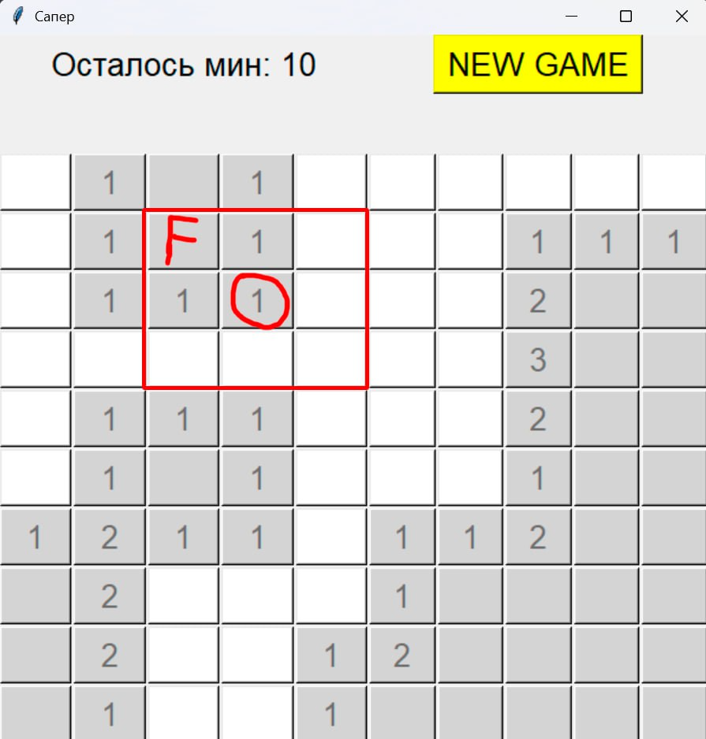

# Minesweeper
Инструкция для Windowns
- скачать файл [Mineswepper.exe](Сапер/Mineswepper.exe)
- запустить
# Правила игры 

Поле состоит из сетки размером 10×10 клеток. Мины расположены на нём в случайном порядке.
Цель игры — отметить флажками все клетки, в которых находятся мины.

Чтобы определить, где могут быть мины, игроку нужно обращать внимание на клетки с цифрами.
Цифра в клетке показывает, сколько мин находится в соседних клетках, то есть в пределах квадрата 3×3, где данная клетка находится в центре.

- Чтобы пометить клетку с миной, нажмите правую кнопку мыши (ПКМ).

- Чтобы открыть пустую клетку, нажмите левую кнопку мыши (ЛКМ).

